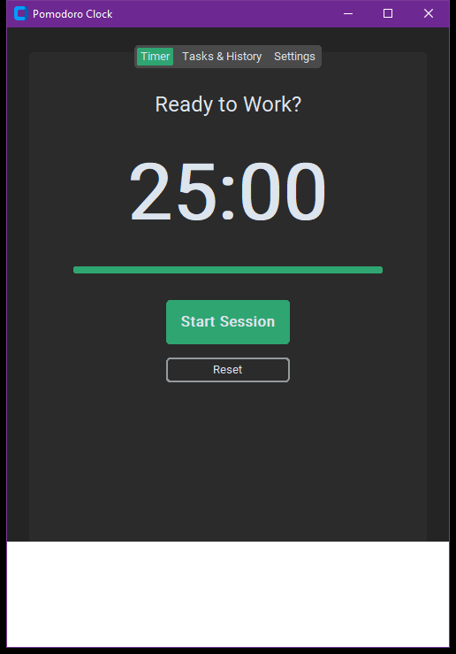

# MASA FocusTimer Suite

Productivity timekeeper implementing the Pomodoro Technique with work-break cycles and telemetry

## Technical Architecture

The application is architected with modular separation of concerns adhering to modern clean code standards:

- **Component Layering**: Isolated view layouts, state managers, and service controllers.
- **Defensive Engineering**: Robust input sanitization and exception management.
- **Modern Design Standards**: High-contrast dark-mode interface styled for optimal usability and visual polish.

## Preview



## Features

- Configurable Focus (25m), Short Break (5m), and Long Break (15m) state machines.
- Circular canvas-rendered progress indicator with real-time countdown.
- Task agenda checklist tracking focus intervals per completed item.
- Audio notifications and discreet desktop alerts upon interval completion.

## Prerequisites

- Python 3.10 or higher
- Required packages:

```bash
pip install customtkinter pillow requests
```

## Execution

Launch the application via Python:

```bash
python "Pomodoro Clock Using Tkinter in Python/main.py"
```

## Project Structure

```
.
├── Pomodoro Clock Using Tkinter in Python
├── screenshots/
│   └── app_interface.png
├── .gitignore
├── LICENSE             # MIT License
└── README.md           # Developer documentation
```

## License

This project is licensed under the terms of the MIT License. Refer to the `LICENSE` file for details.
